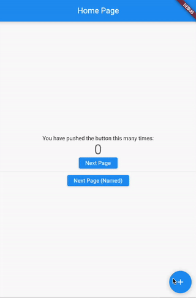

# README

Flutterの画面遷移（Navigator 1.0）の基本と画面間での値の受け渡しのサンプルコードです。

## 関連記事
[【Flutter】画面遷移の基本／値の受け渡し](https://cbtdev.net/flutter-navigator1-basic/)

## サンプル内容

画面遷移元と遷移先の２つのカウンターページで相互にカウント値の受け渡しをしています。

